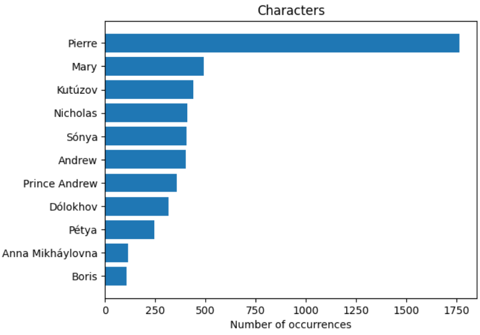
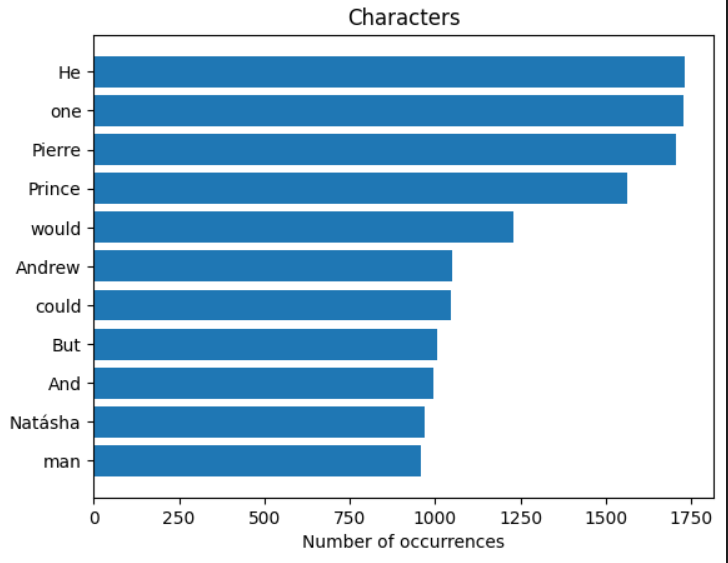
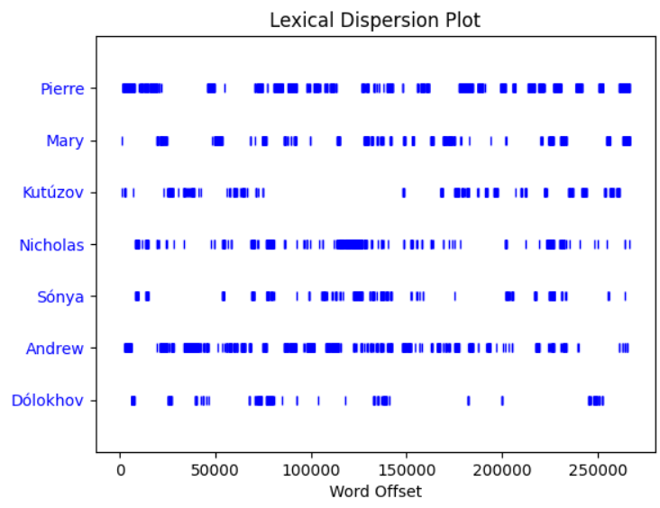
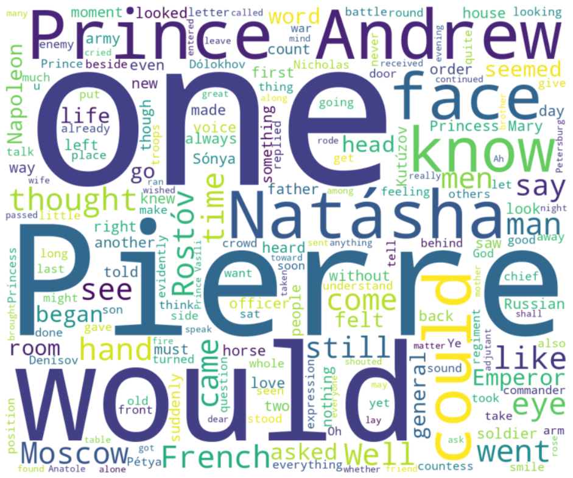

# NLP with Python: Analyzing War and Peace (Leo Tolstoy)

Many things can be accomplished through extracting information from texts. While some of tasks can be performed manually, they would require considerable effort. We can use NLP techniques to deal with this.

So I decided, that I'll show some of usage NLP with Python in this notebook

To do this I used the English version of War and Peace from [wikisource](https://en.wikisource.org/wiki/War_and_Peace_(Tolstoy) .

Leo Tolstoy's War and Peace is a fictional work that combines chapters on history and philosophy with fictional narratives.

## Examples: 

Characters occurrences using spaCy method:

Characters occurrences using count most common words method:

Lexical plot chart:

Wordcloud:

